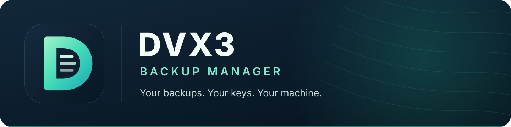

<p align="center">
  
</p>

<p align="center">
  <a href="https://github.com/tadaka9/Dvx3-Backup-Manager/actions/workflows/ci.yml"></a>
  &nbsp; <a href="https://github.com/tadaka9/Dvx3-Backup-Manager/releases">Download native builds</a>
  &nbsp;·&nbsp; <a href="BUILD.md">Build from source</a>
  &nbsp;·&nbsp; <a href="LICENSE">MIT license</a>
</p>

**DVX3** creates encrypted, compressed backups on your own machine. Its Vala
engine owns archive creation, restore, codec selection and job management. A Vala
CLI and a Qt 6 desktop app use that same engine, so the interface does not have
a second backup implementation.

## What you get

- **Private archives.** Argon2id derives a key from your password; libsodium
  authenticates and encrypts the archive. There is no account, cloud service or
  password recovery service.
- **Compression you can choose.** Use no compression, zstd, gzip, bzip2,
  xz/LZMA, lz4, Brotli, 7z or ZPAQ. The archive records its codec so restore
  can select the matching decompressor.
- **One engine, three entry points.** Create or restore in the Qt app, script
  with the CLI, or manage named jobs and retention with the Vala manager.
- **Native, tested builds.** CI builds and tests on five native Linux, macOS
  and Windows environments before publishing downloadable archives.

## Get started

Install the [native build dependencies](BUILD.md#dependencies), then run:

```sh
./build.sh all test
./run_gui.sh
```

The desktop app lets you choose a source, destination, password and locally
available codec. Restore always targets an **empty directory**. For a quick CLI
round trip:

```sh
build/bin/dvx3 --codecs
build/bin/dvx3 encrypt ./documents -p 'choose-a-long-password' -o ./documents.dvx3 --codec zstd
mkdir ./restored
build/bin/dvx3 decrypt ./documents.dvx3 -p 'choose-a-long-password' -o ./restored
```

A password passed with `-p` may appear in shell history and process listings.
Use the desktop app when entering a password interactively. Keep that password
separately; DVX3 cannot recover it.

## Download a tested build

[Releases](https://github.com/tadaka9/Dvx3-Backup-Manager/releases) provides
native build archives and matching SHA-256 checksums. Builds from `main` are
commit-labelled prereleases; `v*` tags produce named releases after all native
jobs pass.

| Platform | Native CI environment | Distribution formats |
| --- | --- | --- |
| Linux x86-64 | Ubuntu 24.04 | DEB, RPM, AppImage, developer tarball |
| Linux ARM64 | Ubuntu 24.04 ARM | DEB, RPM, developer tarball |
| macOS Apple Silicon | macOS 15 ARM64 | `.app.zip`, PKG, developer tarball |
| macOS Intel | macOS 15 Intel | `.app.zip`, PKG, developer tarball |
| Windows x64 | Windows 2022, MSYS2 UCRT64 | portable ZIP, MSI, developer tarball |

The portable Windows ZIP, AppImage and macOS app bundle deploy their Qt runtime.
DEB/RPM use native package dependencies. Developer tarballs retain the unbundled
libraries and bindings. Compression tools are intentionally external and must be
installed for the selected codec. Current MSI and PKG artifacts are unsigned or
ad-hoc signed development releases; Windows SmartScreen and macOS Gatekeeper may
warn until project signing certificates and notarization are configured.

## Compression and extensions

Run `build/bin/dvx3 --codecs` to see which tools are available on your
machine. Built-in choices are `none`, `zstd`, `gzip`, `bzip2`, `xz`,
`lzma`, `lz4`, `brotli`, `7z` and `zpaq`. Linux has local round-trip
coverage for all of them; CI requires the installed set on each runner.
All backups remain encrypted `.dvx3` archives, not standalone 7z/ZPAQ files
or a universal archive extractor.

Local [codec profiles and reversible pipelines](COMPRESSION.md) can connect
other tools without introducing another backup engine. The provided Razor
profile is an **integration example**: it needs a separately supplied vendor
executable and has not been verified here. “FitGirl” is not a single codec;
game-specific repacking chains need their own reversible tools and validation.
No compatibility with FitGirl installers is claimed.

## Named backup jobs

```sh
build/bin/backup-manager add Documents ./documents ./backups zstd 30
build/bin/backup-manager list
DVX3_PASSWORD='choose-a-long-password' build/bin/backup-manager run Documents
build/bin/backup-manager history
build/bin/backup-manager cleanup
```

The manager stores jobs and history in the native user configuration directory;
it never stores passwords. The example environment variable can be visible to
other processes with sufficient access. Retention applies only to archives the
manager recorded. Scheduling and cancellation are not implemented.

## How it is built

```text
Vala CLI ───────────────┐
Vala job manager ───────┼──→ libdvx3 (Vala) ──→ GIO · libsodium · external codecs
Qt 6 desktop + wrapper ┘
```

The Qt app uses a thin C++ binding for the Vala API; it has no parallel
encryption or compression backend. [Architecture](ARCHITECTURE.md) explains the
archive format, portability choices and security tradeoffs.

| For… | Read… |
| --- | --- |
| Dependencies, build targets and platform status | [BUILD.md](BUILD.md) |
| Archive format and security tradeoffs | [ARCHITECTURE.md](ARCHITECTURE.md) |
| Codec matrix, Razor and custom pipelines | [COMPRESSION.md](COMPRESSION.md) |
| Manager commands and migration | [BACKUP_MANAGER_GUIDE.md](BACKUP_MANAGER_GUIDE.md) |
| Desktop operation | [GUI_GUIDE.md](GUI_GUIDE.md) |
| Development installation and C/C++ integration | [INSTALL.md](INSTALL.md) · [CPP_USAGE.md](CPP_USAGE.md) |
| Legacy cleanup | [CLEANUP_REPORT.md](CLEANUP_REPORT.md) |

DVX3 currently stages plaintext data in private temporary directories before
encryption. This needs additional disk space and is not a fully streaming,
zero-plaintext design. Restore authenticates data before extraction, but
extraction is not a sandbox for a malicious archive made by someone who knows
the password. Review [the full tradeoffs](ARCHITECTURE.md#archive-pipeline-and-compatibility)
before relying on DVX3 for sensitive workflows.

Licensed under [MIT](LICENSE).
