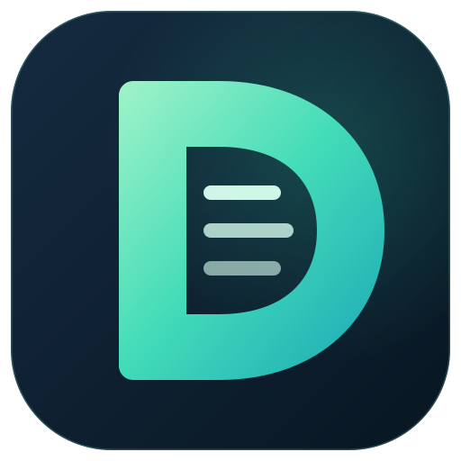

# Dvx3 Backup Manager



A local encrypted-backup tool with a canonical Vala engine, Vala CLI/job manager
and a Qt6 presentation layer. Encryption uses libsodium Argon2id and
XSalsa20-Poly1305. Compression is selectable, with reversible extension pipelines.

## Build and run

Install the dependencies in [BUILD.md](BUILD.md), then:

```sh
./build.sh all test
build/bin/dvx3 --codecs
build/bin/dvx3 encrypt ./documents -p 'your-password' -o ./documents.dvx3 -c zstd
build/bin/dvx3 decrypt ./documents.dvx3 -p 'your-password' -o ./empty-restore
./run_gui.sh
```

Passwords passed with `-p` can appear in shell history/process listings. The GUI
keeps the password in memory; the manager reads `DVX3_PASSWORD` and never saves it.
Keep your password independently: there is no recovery service.

## What is verified

Linux x86_64: core, CLI, Vala manager and Qt GUI compile; archive round trips,
error handling, binding and offscreen GUI startup are tested. gzip, bzip2, xz/LZMA,
zstd, LZ4, Brotli, 7z, ZPAQ and no compression have local round-trip coverage.
Custom xz -> zstd pipelines are also tested.

Linux ARM64, macOS Intel/ARM64 and Windows x64 have native CI jobs configured and
remain candidates until those jobs are actually run. ARMHF, Windows ARM64, MSVC
and cross-compilation are not declared supported. No package builders or
self-contained release binaries are provided.

Razor and repacking chains can integrate through locally supplied profiles/adapters;
they are unverified without their actual tools. See [COMPRESSION.md](COMPRESSION.md)
for the exact limits and extension contracts.

## Job management

```sh
build/bin/backup-manager add Documents ./documents ./backups zstd 30
build/bin/backup-manager list
DVX3_PASSWORD='your-password' build/bin/backup-manager run Documents
build/bin/backup-manager history
build/bin/backup-manager cleanup
```

The no-argument manager provides a command prompt. Job/history persistence and
retention run in Vala. Scheduled execution is not implemented.

## Documentation

- [Build and platform status](BUILD.md)
- [Actual architecture and archive tradeoffs](ARCHITECTURE.md)
- [Compression and custom pipelines](COMPRESSION.md)
- [Manager commands and migration](BACKUP_MANAGER_GUIDE.md)
- [Qt GUI](GUI_GUIDE.md)
- [Development installation](INSTALL.md)
- [C/C++ binding](CPP_USAGE.md)
- [Audit and removed legacy](CLEANUP_REPORT.md)

Plaintext staging consumes disk in private temporary directories. Restore verifies
payload before extracting and requires an empty destination; read the architecture
notes before treating this as a fully streaming or malicious-archive sandbox.

MIT license; see [LICENSE](LICENSE).
